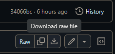
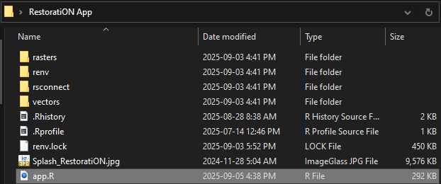
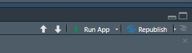
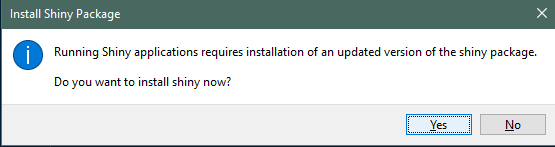

# RestoratiON
Ontario Ministry of Natural Resources (OMNR) Landscape Ecology restoration prioritization project. This application aims to identify degraded land areas within a chosen geographic region and determine which areas, when restored to nearby natural habitat types, will provide the greatest benefit to biodiversity based on user-selected criteria.

## Prerequisites

We provide instructions on how to run the tool in a Windows environment. This tool has not been tested on Mac or Linux. In order to run the app locally on your own machine you first need to download and install:

1. **R:** <https://cran.rstudio.com/> (Click 'Download R for Windows' and install to your machine).
2. **Rtools (Windows):** <https://cran.rstudio.com/bin/windows/Rtools/> (Download RTools 4.4).
3. **RStudio:** <https://posit.co/download/rstudio-desktop/> (Click 'Download RStudio Desktop for Windows').

### Get the Base Files

4. Download the base files that contain the spatial data to run the tool from:  
   <https://sobr.ca/wp-content/uploads/RestoratiON-App.zip>  
   Unzip this folder on your local machine; note where you've placed the folder.

5. To ensure you are using the most up-to-date version of the tool's scripts, download the `app.R` file from this repository and place it in the base directory you just unzipped, overwriting the existing `app.R` in the folder.  
   **[Download app.R](https://github.com/rich00feld/RestoratiON/blob/main/app.R)**

   After you have navigated to the app.R page in GitHub, find the 'download raw file' icon at the upper left of the page. It looks like a downward arrow pointing towards an open square box.
   
    

   After downloading app.R, replace the app.R file in the "Restoration App" folder you downloaded and unzipped in step 4. This ensures that you are using the most up-to-date script.
   
    

---

## Running the App

6. Open `app.R` in RStudio and press **CTRL + SHIFT + ENTER** or alternatively click **Run App** in the top-right of the script pane.

   

The app will initialize and ask if you want to install the **Shiny** package, click yes.

 


When the app first runs it may take a while to install all the dependent packages, but this will only occur once in a given installation, and not occur if the app is re-run. 

---

### Optional: Set the App Run Mode

The app has the option to run calculations **sequentially** (slower but less memory intensive) or in **parallel** (faster but more memory intensive). By default, the app is set to run **sequentially**. If your system has multiple CPU cores and sufficient RAM, the app can use parallelization instead. 

7. To enable parallel mode, change the integer at `run_mode <- reactiveVal(1)` to `2` so it reads:

```r
# set up reactive values
run_mode <- reactiveVal(2)  # 1 = sequential, 2 = parallel
```
> Tip: Use **Ctrl + F** in the editor to search for `run_mode <- reactiveVal`.

Then save your changes (**Ctrl + S**) before running the app.

---

### Optional: Set the Number of Parallel Workers

You can control the number of workers (CPU cores) used in parallel mode. Two workers were most stable on the systems tested, but you may increase this if you have sufficient RAM and CPU cores.

- A general rule of thumb is **RAM (GB) ÷ 8 ≈ workers**  
  e.g., 16 GB RAM → 2 workers; 32 GB RAM → 4 workers.  
  (This may vary depending on your CPU.)

8. To set the number of workers, change the integer at `set_cores <- reactiveVal(2)` to a suitable value for your stystem (the example below uses 4):

```r
# set the number of parallel workers
set_cores <- reactiveVal(4)
```
Then save your changes (**Ctrl + S**) before running the app.

---

## Notes

- If you want to switch back to sequential mode, set `run_mode <- reactiveVal(1)`.
- If you experience package installation prompts when you first run the app, please wait. Let R install all required packages; subsequent runs of the app will be much faster.
- Keep your `app.R` up to date by downloading from the **latest release** before running.

---


